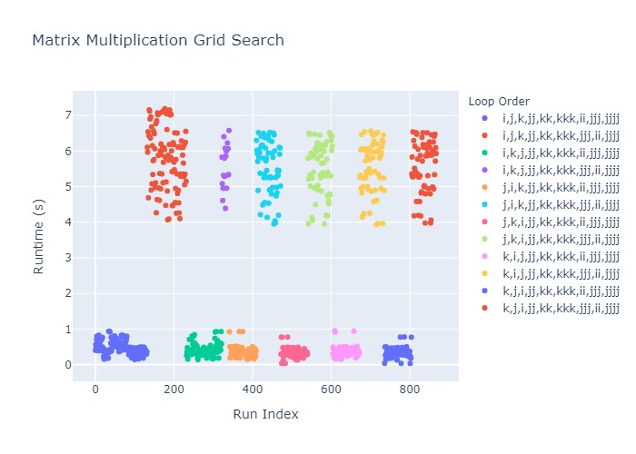
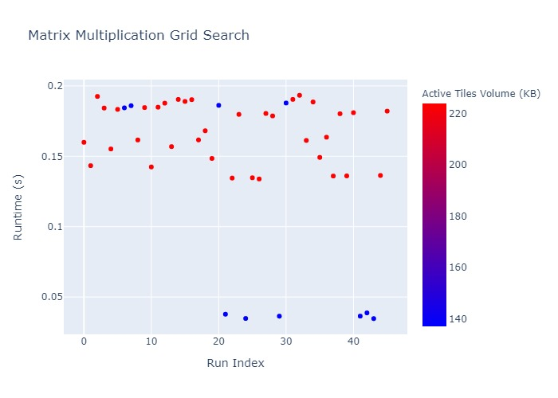

# Case Study - MatMul Grid Search

In this case study, we will discuss how to construct a performant implementation for matrix multiplication on an AVX2 Machine using Accera. First, we will show how to create a parameterized Accera schedule and action plan, then we will discuss how to create a parameters grid, and how to benchmark each point in the grid in order to pick the best performant implementation. Note that for different target hardwares, the process would be similar, however, the results would be different.

As introduced in Section 0 of the Accera manual, a matrix multiplication between an `M`&times;`S` matrix `A` and an `S`&times;`N` matrix `B`, will result in an `M`&times;`N` matrix `C`, where `C += A @ B`. The logic for the matrix multiplication can be expressed in python as

```python
for i in range(M):
    for j in range(N):
        for k in range(S):
            C[i,j] = A[i,k] * B[k,j]
```

In this case study, we present the end-to-end steps needed to write a performant implementation for matrix multiplication as follows:
- [Write a parameterized Accera implementation for matrix multiplication](#step-1---create-a-accera-matmul-function).
- [Create a parameters grid for the parameterized implementation](#step-2---create-parameters-grid).
- [Filter the parameters grid according to some constraints and intuitive rules](#step-3---filter-the-parameters-grid).
- [Create a Accera package using the filtered parameters grid](#step-4---create-a-accera-package-with-all-parameters-choices-in-the-filtered-parameters-grid).
- [Benchmark the package on the target hardware](#step-5---benchmark-the-package-on-the-target-hardware).
- [Find the optimal parameters choice](#step-6---find-the-optimal-parameters-choice)
- [Create a Accera package with the optimal function](#step-7---create-a-accera-package-with-the-optimal-function)
- [Visualize the parameters grid as well as the benchmarking results](#step-8---visualize-the-parameters-grid).


## Step 1 - Create a Accera Matmul Function
As introduced in Section 2 of the Accera manual, we can implement the above python implementation for matrix multiplication using Accera as follows:

```python
import accera as acc

M, N, S = 1020, 1024, 1024

A = acc.Array(role=acc.Array.Role.INPUT, element_type=acc.ScalarType.float32, shape=(M, S))
B = acc.Array(role=acc.Array.Role.INPUT, element_type=acc.ScalarType.float32, shape=(S, N))
C = acc.Array(role=acc.Array.Role.INPUT_OUTPUT, element_type=acc.ScalarType.float32, shape=(M, N))

# Define a simple affine loop nest and name its loops i, j, k
nest = acc.Nest(shape=(M, N, S))
i, j, k = nest.get_indices()

# Define the logic of each iteration in the nest
@nest.iteration_logic
def _():
    C[i,j] += A[i,k] * B[k,j]

# Define Schedule
schedule = nest.create_schedule()

# Define Action Plan
plan = schedule.create_action_plan()

# Add the function to a package and build the package
name = f"matmul_{M}_{N}_{S}"
package = acc.Package()
function = package.add_function(plan, args=(A, B, C), base_name=name)
package.build(name, format=acc.Package.Format.HAT, output_dir=name)
```

This implementation would use the default schedule and action plan. This Accera snippet would produce the correct results, but will not produce an efficient implementation. We can improve the efficiency of this Accera implementation using schedule and action plan optimizations such as splits, vectorization, unrolling, and caching.

For this case study, we choose to first do a tiling split per dimension to fit some active tiles of the input and output matrices in the L2 Cache, then we will also do a second round of smaller splits, unrolling and vectorization along some dimensions to make use of the registers on the target hardware.

For this step, we will start with some chosen values for the split sizes and the schedule loop order. However, in the next steps we will discuss how to define a parameter grid and search through it to get the performant implementation for the target hardware.

First, we define the input and output arrays
```python
A = acc.Array(role=acc.Array.Role.INPUT, element_type=acc.ScalarType.float32, shape=(M, S))
B = acc.Array(role=acc.Array.Role.INPUT, element_type=acc.ScalarType.float32, shape=(S, N))
C = acc.Array(role=acc.Array.Role.INPUT_OUTPUT, element_type=acc.ScalarType.float32, shape=(M, N))
```

Then, we define some parameters that would be used later while creating the schedule and the action plan
```python
p_m_split_size, p_n_split_size, p_s_split_size, \
        p_s_split_2_size, p_n_split_2_size, p_n_split_3_size = acc.create_parameters(6)
```

Then, we define the iteration logic for matrix multiplication
```python
# Define a simple affine loop nest and name its loops i, j, k
nest = acc.Nest(shape=(M, N, S))
i, j, k = nest.get_indices()

# Define the logic of each iteration in the nest
@nest.iteration_logic
def _():
    C[i,j] += A[i,k] * B[k,j]
```

Next, we define the matrix multiplication schedule. As mentioned earlier, we choose to first do a tiling split per dimension to improve cache utilization, then we do a second round of smaller splits to improve register utilization.
```python
schedule = nest.create_schedule()

# Tile splits to place some blocks of the input and output matrices in the L2 cache
ii, jj, kk = schedule.tile(indices=(i, j, k), shape=(p_m_split_size, p_n_split_size, p_s_split_size))

# Kernel splits
kkk = schedule.split(kk, p_s_split_2_size)
jjj = schedule.split(jj, p_n_split_2_size)
jjjj = schedule.split(jjj, p_n_split_3_size)

# Permute the indices
# Note: this will be part of Accera parameters in a later version
unpermuted_indices = [i, j, k, ii, jj, kk, kkk, jjj, jjjj]
loop_order = [1, 2, 0, 4, 5, 6, 3, 7, 8]
permuted_indices = [unpermuted_indices[idx] for idx in loop_order]

# Apply re-ordering
schedule.reorder(permuted_indices)
```

Then, we define an action plan, and we use caching, unrolling, and vectorization to make the implementation more performant.
```python
plan = schedule.create_action_plan()

# Cache input and output arrays
plan.cache(B, index=jj)
plan.cache(C, index=ii)

# Unroll the non-vectorized kernel loops
plan.unroll(permuted_indices[-2])
plan.unroll(permuted_indices[-3])

# Vectorize the innermost kernel loop
plan.vectorize(permuted_indices[-1])
```
To create a package with this matrix multiplication function, we need to know the values of the parameters `m_split_size`, `n_split_size`, `s_split_size`, `loop_order`, `n_split_2_size`, `n_split_3_size`, and `s_split_2_size`. Let's assume for now that we are given those constants, then we could set those parameters, and add the function to the Accera package and build it. However, we will explain in the next section how to get the right values for them

```python
auxiliary_data = {"m_split_size": p_m_split_size,
                  "n_split_size": p_n_split_size,
                  "s_split_size": p_s_split_size,
                  "n_split_2_size": p_n_split_2_size,
                  "n_split_3_size": p_n_split_3_size,
                  "s_split_2_size": p_s_split_2_size}

name = f"matmul_{M}_{N}_{S}"
package = acc.Package()
function = package.add_function(plan,
                    args=(A, B, C),
                    parameters={
                        p_m_split_size: m_split_size,
                        p_n_split_size: n_split_size,
                        p_s_split_size: s_split_size,
                        p_n_split_2_size: n_split_2_size,
                        p_n_split_3_size: n_split_3_size,
                        p_s_split_2_size: s_split_2_size
                    },
                    base_name=function_name,
                    auxiliary=auxiliary_data)
package.build(name, format=acc.Package.Format.HAT, output_dir=name)
```

Pulling it all together
```python
import accera as acc

def add_matmul_function(M, N, S, package, parameters_choice):
    '''
        This function is a accera implementation for matrix multiplication
        of two matrices A and B, A has shape M*S and B has shape S*N.
        Python implemntation:
        ---------------------
        for i in range(M):
            for j in range(N):
                for k in range(S):
                    C[i,j] = A[i,k] * B[k,j]
    '''

    m_split_size, n_split_size, s_split_size, loop_order, \
            s_split_2_size, n_split_2_size, n_split_3_size = parameters_choice

    # Even though we have the current parameter choices available, construct the Accera loopnest
    # with parameterization for flexibility down the road
    p_m_split_size, p_n_split_size, p_s_split_size, \
            p_s_split_2_size, p_n_split_2_size, p_n_split_3_size = acc.create_parameters(6)

    A = acc.Array(role=acc.Array.Role.INPUT, element_type=acc.ScalarType.float32, shape=(M, S))
    B = acc.Array(role=acc.Array.Role.INPUT, element_type=acc.ScalarType.float32, shape=(S, N))
    C = acc.Array(role=acc.Array.Role.INPUT_OUTPUT, element_type=acc.ScalarType.float32, shape=(M, N))

    # Define a simple affine loop nest and name its loops i, j, k
    nest = acc.Nest(shape=(M, N, S))
    i, j, k = nest.get_indices()

    # Define the logic of each iteration in the nest
    @nest.iteration_logic
    def _():
        C[i,j] += A[i,k] * B[k,j]

    schedule = nest.create_schedule()

    # Tile splits to place some blocks of the input and output matrices in the L2 cache
    ii, jj, kk = schedule.tile(indices=(i, j, k), shape=(p_m_split_size, p_n_split_size, p_s_split_size))

    # Kernel splits
    kkk = schedule.split(kk, p_s_split_2_size)
    jjj = schedule.split(jj, p_n_split_2_size)
    jjjj = schedule.split(jjj, p_n_split_3_size)

    # Permute the indices
    # Note: this will be part of Accera parameters in a later version
    unpermuted_indices = [i, j, k, ii, jj, kk, kkk, jjj, jjjj]
    permuted_indices = [unpermuted_indices[idx] for idx in loop_order]

    # Apply re-ordering
    schedule.reorder(permuted_indices)

    plan = schedule.create_action_plan()

    # Cache input and output arrays
    plan.cache(B, index=jj)
    plan.cache(C, index=ii)

    # Unroll the non-vectorized kernel loops
    plan.unroll(permuted_indices[-2])
    plan.unroll(permuted_indices[-3])

    # Vectorize the innermost kernel loop
    plan.vectorize(permuted_indices[-1])

    auxiliary_data = {"m_split_size": m_split_size,
                      "n_split_size": n_split_size,
                      "s_split_size": s_split_size,
                      "order": ",".join([str(i) for i in loop_order]),
                      "n_split_2_size": n_split_2_size,
                      "n_split_3_size": n_split_3_size,
                      "s_split_2_size": s_split_2_size
                     }

    function_name = f"matmul_{M}_{N}_{S}"
    function = package.add_function(plan,
                        args=(A, B, C),
                        parameters={
                            p_m_split_size: m_split_size,
                            p_n_split_size: n_split_size,
                            p_s_split_size: s_split_size,
                            p_n_split_2_size: n_split_2_size,
                            p_n_split_3_size: n_split_3_size,
                            p_s_split_2_size: s_split_2_size
                        },
                        base_name=function_name,
                        auxiliary=auxiliary_data)
    return function

M, N, S = 1020, 1024, 1024
m_split_size, n_split_size, s_split_size = 8, 256, 128
loop_order = [1, 2, 0, 4, 5, 6, 3, 7, 8]
s_split_2_size, n_split_2_size, n_split_3_size = 4, 16, 8

parameters_choice = [m_split_size, n_split_size, s_split_size, \
                    loop_order, s_split_2_size, n_split_2_size, n_split_3_size]

package = acc.Package()
name = f"matmul_{M}_{N}_{S}"
add_matmul_function(M, N, S, package, parameters_choice)
package.build(name, format=acc.Package.Format.HAT, output_dir=name)
```
The next step would be to choose the right values for `m_split_size`, `n_split_size`, `s_split_size`, `loop_order`, `n_split_2_size`, `n_split_3_size`, and `s_split_2_size`

## Step 2 - Create parameters grid
As mentioned in the previous step, we assumed some values for the split sizes and the schedule loop order. However, for each different hardware the parameters values that produces the best performant implementation can be different. To ensure that the created Accera function is performant (i.e. has the right parameters), we define a parameters grid where our chosen parameters are:
1. `m_split_size`
2. `n_split_size`
3. `s_split_size`
4. `loop_order`
5. `n_split_2_size`
6. `n_split_3_size`
7. `s_split_2_size`

and our grid will consist of a set of possible values for those parameters.

For example, we might want to:
1. define the `m_split_size`, `n_split_size`, and `s_split_size` split sizes as the even numbers between 4 and 8,
   and the powers of 2 between 16 and 256.
2. define the `n_split_2_size`, `n_split_3_size`, and `s_split_2_size` as the powers of 2 between 4 and 16.
3. define the possible schedule loops order as any order where i, j, and k are the outer most loops in any order,
    and all the other loops follow in any order. The reason is that i, j, and k are the large scale loops,
    so having them as the outer most loops can improve caching utilization.

First we define the choices for each parameter.

```python
# define the m_split_size, n_split_size, and s_split_size split sizes as the even numbers between 4 and 8,
# and the powers of 2 between 4 and 256
m_split_size_choices = [4, 6, 8, 16, 32, 64, 128, 256]
n_split_size_choices = [4, 6, 8, 16, 32, 64, 128, 256]
s_split_size_choices = [4, 6, 8, 16, 32, 64, 128, 256]

# define the n_split_2_size, n_split_3_size and s_split_2_size as the powers of 2 between 4 and 16
n_split_2_size_choices = [4, 8, 16]
n_split_3_size_choices = [4, 8, 16]
s_split_2_size_choices = [4, 8, 16]

# Define the possible schedule loops order as any order that preserves the accera
# split="jj" splits the schedule loop space into two spaces, the first has ("i", "j", "k"),
# while the second has ("jj", "kk", "kkk", "ii", "jjj", "jjjj").
order_choices = get_order_permutations(initial_order=["i", "j", "k", "jj", "kk", "kkk", "ii", "jjj", "jjjj"],
                                       split="jj")
```
Next, we construct our parameters grid by getting all the combinations of the defined values for each parameter.
```python
parameters_choices = [m_split_size_choices, n_split_size_choices, s_split_size_choices, order_choices, \
                      s_split_2_size_choices, n_split_2_size_choices, n_split_3_size_choices]

parameters_grid = list(itertools.product(*parameters_choices))
```

## Step 3 - Filter the parameters grid
The previous step would produce a **huge parameters grid**. For example, the chosen parameters choices in the previous step results in a parameters grid of size **59,719,680**, if each different point takes 1 second of evaluation, then this run would take **691.2 days**. This is unreasonable. However, we can notice that some points in the parameters grid might not be worth searching. For example:
1. It is meaningless to choose a second split of size larger than the first split on the same dimension, so we can filter those cases out.
2. We know that we need the active tiles of the input and output matrices to fit in the L2 cache without overflowing it, so we can choose the tile sizes such that the total memory needed for the active tiles of the input and output matrices are at least 50\% of the cache size, but less that its total size.
3. Any loop order has to meet the Accera order constraint that "An inner dimension must not be ordered before its outer dimension". For example: The current kernel order in our function is "`i, j, k, jj, kk, kkk, ii, jjj, jjjj`", then `i` must always precede `ii` and `k` must always precede `kk` and so on, also we might want some indices to be fixed.

Using those simple filters, we can reduce the parameters grid size to **4914** different parameters choices, which is completely reasonable to evaluate.

Note that the utility functions `valid_split_size`, `fits_in_l2`, `uses_enough_l2`, and `valid_order_choice` are implemented in `samples/Matrix Multiplication/utils.py`.
```python
filtered_parameter_grid = []
for parameters_grid_point in parameters_grid:
    m_split_size, n_split_size, s_split_size, loop_order, \
        s_split_2_size, n_split_2_size, n_split_3_size = parameters_grid_point

    if not valid_split_size(n_split_size, n_split_2_size) \
        or not valid_split_size(n_split_2_size, n_split_3_size) \
        or not valid_split_size(s_split_size, s_split_2_size) \
        or not fits_in_l2(m_split_size, n_split_size, s_split_size, element_size, l2_cache_size) \
        or not uses_enough_l2(m_split_size, n_split_size, s_split_size, element_size, l2_cache_size) \
        or not valid_order_choice(order_choice=loop_order,
                                  initial_order=["i", "j", "k", "jj", "kk", "kkk", "ii", "jjj", "jjjj"],
                                  preserve_partial_order_list=[("i", "ii"),
                                                              ("j", "jj"),
                                                              ("jj", "jjj"),
                                                              ("jjj", "jjjj"),
                                                              ("k", "kk"),
                                                              ("kk", "kkk")],
                                  # Empirically optimize utilization from caching Matrix B
                                  fixed_indices=["jj", "kk", "kkk"]):
        continue
    else:
        filtered_parameter_grid.append(parameters_grid_point)
```

## Step 4 - Create a Accera package with all parameters choices in the filtered parameters grid
In this step, we would create a Accera package with all the parameters variants in the filtered parameters grid.
To enable faster package build, we added a parallelized version of the code below in `samples/Matrix Multiplication/matmul_gridsearch_case_study.py` that would distribute the package build over different processes.

```python
package = acc.Package()
name = f"matmul_{M}_{N}_{S}"
for choice in filtered_parameters_grid:
        add_matmul_function(M=M, N=N, S=S, package=package, parameters_choice=choice)
package.build(name, format=acc.Package.Format.HAT, output_dir=name)
```

<!--
Alternatively, we can use the utility function `add_functions_from_grid` in accera as mentioned in Section 9 of the Accera manual as follows (Note that in this case, we will need to follow the same steps to construct the parameters grid, then we would filter the grid points and then reshape the parameters grid to a dictionary instead.).

```python
import accera as acc

p_m_split_size, p_n_split_size, p_s_split_size, p_loop_order, \
            p_s_split_2_size, p_n_split_2_size, p_n_split_3_size = acc.create_parameters(7)

A = acc.Array(role=acc.Array.Role.INPUT, element_type=acc.ScalarType.float32, shape=(M, S))
B = acc.Array(role=acc.Array.Role.INPUT, element_type=acc.ScalarType.float32, shape=(S, N))
C = acc.Array(role=acc.Array.Role.INPUT_OUTPUT, element_type=acc.ScalarType.float32, shape=(M, N))

# Define a simple affine loop nest and name its loops i, j, k
nest = acc.Nest(shape=(M, N, S))
i, j, k = nest.get_indices()

# Define the logic of each iteration in the nest
@nest.iteration_logic
def _():
    C[i,j] += A[i,k] * B[k,j]

schedule = nest.create_schedule()

# Tile splits to place some blocks of the input and output matrices in the L2 cache
ii, jj, kk = schedule.tile(indices=(i, j, k), shape=(p_m_split_size, p_n_split_size, p_s_split_size))

# Kernel splits
kkk = schedule.split(kk, p_s_split_2_size)
jjj = schedule.split(jj, p_n_split_2_size)
jjjj = schedule.split(jjj, p_n_split_3_size)

# Start from this order that separates the large scale loops (i, j, k)
# from the high performance loops (jj, kk, kkk, ii, jjj, jjjj)
schedule.reorder(i, j, k, jj, kk, kkk, ii, jjj, jjjj)

# Apply re-ordering according to "p_loop_order" parameter
schedule.reorder(p_loop_order)

plan = schedule.create_action_plan()

# Cache input and output arrays
plan.cache(B, index=jj)
plan.cache(C, index=ii)

# Unroll the non-vectorized kernel loops
plan.unroll(p_loop_order[-2])
plan.unroll(p_loop_order[-3])

# Vectorize the innermost kernel loop
plan.vectorize(p_loop_order[-1])

auxiliary_data = {"m_split_size": p_m_split_size,
                  "n_split_size": p_n_split_size,
                  "s_split_size": p_s_split_size,
                  "n_split_2_size": p_n_split_2_size,
                  "n_split_3_size": p_n_split_3_size,
                  "s_split_2_size": p_s_split_2_size}

package = acc.Package()
function_name = f"matmul_{M}_{N}_{S}"
function = acc.add_functions_from_grid(package,
                        plan,
                        args=(A, B, C),
                        parameter_grid={
                            p_m_tile_size: parameters_grid["m_tile_size"],
                            p_n_tile_size: parameters_grid["n_tile_size"],
                            p_s_tile_size: parameters_grid["s_tile_size"],
                            p_loop_order: [permute([i, j, k, jj, kk, kkk, ii, jjj, jjjj], order) \
                                                    for order in parameters_grid["loop_order"]],
                            p_n_split_2_size: parameters_grid["n_split_2_size"],
                            p_n_split_3_size: parameters_grid["n_split_3_size"],
                            p_s_split_2_size: parameters_grid["s_split_2_size"],
                        },
                        base_name=function_name,
                        auxiliary=auxiliary_data)
```
-->

## Step 5 - Benchmark the package on the target hardware
Finally, we can use the autobenchmarking tool to check the correctness of the function implementation, and benchmark our Accera package on the target hardware, then we write back the results to the package.
```python
benchmark = acc.tuning.AutoBenchmark(package_directory)

functions = benchmark.functions
for function_name in functions:
    if "Initialize" in function_name: # Skip init functions
        continue
    correctness_check_values = get_input_output_pairs(M, N, S)

    # NOTE: We place the benchmarking in try .. except block to prevent stopping
    #       the gridsearch in case of a function that failed the correctness check.
    #       However, this is redundunt in this case study since all the applied transformations are safe.
    try:
        mean_time_secs, _ = benchmark.run(function_name,
                                        min_timing_iterations=5,
                                        warmup_iterations=1,
                                        correctness_check_values=correctness_check_values)

        if write_back:
            # Write back the runtime to the HAT file
            hat_file_path = os.path.join(package_directory, "matmul" + ".hat")
            write_back_to_hat(hat_file_path, function_name, mean_time_secs)
    except:
        print(f"WARNING: function {function_name} failed correctness check.")
```

## Step 6 - Find the optimal parameters choice
In this step, we will simple load the data from the HAT file to a pandas dataframe, and then the optimal parameters choice would be the one with minimum runtime.
```python
data = get_auxiliary_data(output_directory)
dataframe = load_to_dataframe(data)
optimal_point_idx = dataframe['runtime'].idxmin()
optimal_point = dataframe.iloc[optimal_point_idx]
return optimal_point
```
This would return the optimal parameters as shown below.
```
m_split_size                                           6
n_split_size                                         256
s_split_size                                         128
order                        j,k,i,jj,kk,kkk,ii,jjj,jjjj
n_split_2_size                                        16
n_split_3_size                                         8
s_split_2_size                                         4
```

## Step 7 - Create a Accera package with the optimal function
Finally, we would use the optimal parameters to create a Accera package with the best performant function.
```python
# Create a new Accera package using the optimal parameters
optimal_package = acc.Package()

optimal_parameters = [int(optimal_point["m_split_size"]),
                      int(optimal_point["n_split_size"]),
                      int(optimal_point["s_split_size"]),
                      str_to_list(optimal_point["order"]),
                      int(optimal_point["s_split_2_size"]),
                      int(optimal_point["n_split_2_size"]),
                      int(optimal_point["n_split_3_size"])]

add_matmul_function(M=M, N=N, S=S, package=optimal_package, parameters_choice=optimal_parameters)

# Build the accera package
name = f"matmul_{M}_{N}_{S}"
optimal_output_directory = name + "_optimal"
optimal_package.build(name, format=acc.Package.Format.HAT, output_dir=optimal_output_directory)
```

## Step 8 - Visualize the parameters grid
Finally, we load the package into a [pandas](https://pandas.pydata.org/) dataframe, and use the visualization tool [plotly](https://plotly.com/) to visualize the parameters grid as well as the benchmarking results. Note that the utility functions get_auxiliary_data and load_to_dataframe are implemented in `samples/Matrix Multiplication/utils.py`.

```python
def plot_dataframe(df, output_directory):
    import plotly.express as px

    tile_volume = []

    for i in range(len(df["runtime"])):
        vol = df["m_split_size"][i] * df["s_split_size"][i] + \
              df["s_split_size"][i] * df["n_split_size"][i] + \
              df["m_split_size"][i] * df["n_split_size"][i] # A tile + B tile + C tile

        vol = vol*4 / 1024 # Total tiles memory in KB (NOTE: assume float elements of 4 bytes each)
        tile_volume.append(vol)

    df["tile_volume"] = tile_volume

    fig = px.scatter(df, x="idx", y="runtime", color="tile_volume", \
                        labels={"runtime": "Runtime (s)", "idx": "Index", "tile_volume": "Tile Volume"}, \
                        hover_data=['m_split_size',"n_split_size", "s_split_size", "order", "tile_volume", \
                                    "s_split_2_size", "n_split_2_size", "n_split_3_size"], \
                        title=f"Matrix Multiplication Grid Search",
                        color_continuous_scale=px.colors.sequential.bluered)

    fig.write_html(os.path.join(output_directory, f"package_and_benchmarking_visualization.html"))

data = get_auxiliary_data(output_directory)
dataframe = load_to_dataframe(data)
plot_dataframe(dataframe, output_directory)
```

The figure below shows a sample of 900 points from out parameters grid. Each point represents a different point from our parameters grid, and the y-axis represents the runtime in seconds. The points are color-coded by the chosen loop order for the schedule.

Note: Load this [html file](./figs/matmul_package_and_benchmarking_visualization_order.html) to open an interactive figure.



The sample points tend to form two clusters: high performance cluster (i.e. with smaller runtime) and low performance cluster (i.e. with larger runtime). We can notice that the main difference between the two clusters is the order of the indices in the three inner most loops. The high performance cluster has the three inner most loops as `ii,jjj,jjjj`, while the low performance cluster has the three inner most loops as `jjj,ii,jjjj`. The reason is that having the order `ii,jjj,jjjj` optimize register usage which leads to optimal runtime.

Then, we zoom in to the best performing 5% of implementations, and we color code themm with the active tile volume (i.e. the total memory needed to store the tiles from matices `A`, `B`, and `C` given the `m_split_size`, `n_split_size`, and `s_split_size`).



We can notice that generally the points with smaller active tile volumes tend to perform better.

## Pull it all together
For convenience, we wrote all the code snippets used in this case study in `samples/Matrix Multiplication/matmul_gridsearch_case_study.py`. To run all the case study steps, the command below can be used.
```
python matmul_gridsearch_case_study.py --matmul_dim 1020 1024 1024 --output_directory matmul_gridsearch_case_study
```
