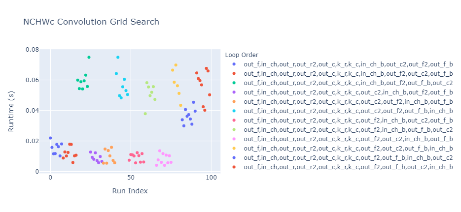
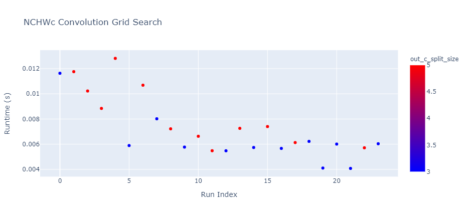
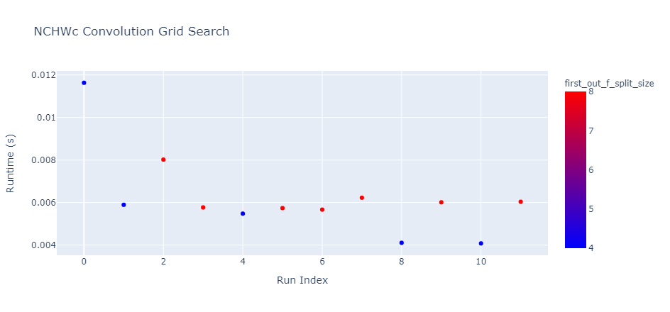

[//]: # (Project: Accera)
[//]: # (Version: 1.2.0)

# Case Study - NCHWc 2D Convolution Grid Search

In this case study, we will discuss how to construct a performant implementation for NCHWc 2D Convolution on an AVX2 Machine using Accera. First, we will show how to create a parameterized Accera schedule and action plan. Then we will discuss how to create a parameters grid, and how to benchmark each point in the grid in order to pick the best performant implementation.

A 2D convolution between a 3D input tensor of dimensions `input_rows`&times;`input_columns`&times;`input_channels` and a 4D weights tensor of dimensions `kernel_rows`&times;`kernel_columns`&times;`input_channels`&times;`output_filters` would result in a 3D output tensor of dimensions `output_rows`&times;`output_columns`&times;`output_filters`.
`output_rows` is defined as `(input_rows - kernel_rows)/row_stride + 1`, while `output_columns` is defined as `(input_columns - kernel_columns)/column_stride + 1`. `row_stride` and `column_stride` control the stride for the convolution. The logic for the 2D covolution can be expressed in python as follows

```python
for out_f in range(output_filters):
    for out_r in range(output_rows):
        for out_c in range(output_columns):
            for in_ch in range(input_channels):
                for k_r in range(kernel_rows):
                    for k_c in range(kernel_columns):
                        in_r = out_r * row_stride + k_r
                        in_c = out_c * column_stride + k_c
                        Output[out_r, out_c, out_f] += Input[in_r, in_c, in_ch] * Weights[k_r, k_c, in_ch, out_f]
```

For NCHWc 2D convolution, the input and output tensors need to be re-ordered from the NHWC format to the NCHWc format. In this case the 2D convolution occurs between a 4D input tensor of dimensions `input_channel_blocks`&times;`input_rows`&times;`input_columns`&times;`input_channels` and a 4D weights tensor of dimensions `kernel_rows`&times;`kernel_columns`&times;`total_input_channels`&times;`total_output_filters` resulting in a 4D output tensor of dimensions `output_filters_blocks`&times;`output_rows`&times;`output_columns`&times;`output_filters`. The logic for the NCHWc 2D covolution can be expressed in python as

```python
for out_f in range(output_filters_blocks):
    for in_ch in range(input_channel_blocks):
        for out_r in range(output_rows):
            for out_c in range(output_columns):
                for out_f_b in range(output_filters):
                    for in_ch_b in range(input_channels):
                        for k_r in range(kernel_rows):
                            for k_c in range(kernel_columns):
                                in_r = out_r * row_stride + k_r
                                in_c = out_c * column_stride + k_c
                                k_ch = in_ch * input_channels + in_ch_b
                                k_f = out_f * output_filters + out_f_b
                                Output[out_f, out_r, out_c, out_f_b] += Input[in_ch, in_r, in_c, in_ch_b] * Weights[k_r, k_c, k_ch, k_f]
```

In this case study, we present the end-to-end steps needed to write a performant implementation for NCHWc 2D Convolution as follows:

- [Write a parameterized Accera implementation for NCHWc 2D Convolution](#step-1-create-a-accera-nchwc-convolution-function)
- [Create a parameters grid for the parameterized implementation](#step-2-create-parameters-grid)
- [Filter the parameters grid according to some heuristics and intuitive rules](#step-3-filter-the-parameters-grid)
- [Create a Accera package using the filtered parameters grid](#step-4-create-a-accera-package-with-all-parameters-candidates-in-the-filtered-parameters-grid)
- [Benchmark the package on the target hardware](#step-5-benchmark-the-package-on-the-target-hardware)
- [Find the optimal parameters choice](#step-6-find-the-optimal-parameters-choice)
- [Create a Accera package with the optimal function](#step-7-create-a-accera-package-with-the-optimal-function)
- [Visualize the parameters grid as well as the benchmarking results](#step-8-visualize-the-parameters-grid)


## Step 1 - Create a Accera NCHWc Convolution Function
As mentioned earlier, the NCHWc convolution uses a different memory layout for the input and output tensors. The input to the convolution needs to be reordered from the 3D NHWC layout into 4D NCHWc layout by doing a split along the channels dimensions. While the output from the convolution needs to be reordered from the 4D NCHWc tensors back into the initial 3D NHWC memory layout.

Re-ordering the tensor layout from NHWC into NCHWc can be expressed in python as follows:

```python
NCHWc_tensor = np.zeros((nchwc_channels_blocks, rows, columns, nchwc_channels)).astype(np.float32)

for ch in range(nchwc_channels_blocks):
    for r in range(rows):
        for c in range(columns):
            for ch_b in range(nchwc_channels):
                if ch * nchwc_channels + ch_b < total_channels:
                    NCHWc_tensor[ch, r, c, ch_b] = NHWC_tensor[r, c, ch * nchwc_channels + ch_b]
```

Re-ordering the tensor layout from NCHWc back into NHWC can be expressed in python as follows:

```python
NHWC_tensor = np.zeros((rows, columns, total_channels)).astype(np.float32)

for ch in range(nchwc_channels):
    for r in range(rows):
        for c in range(columns):
            for ch_b in range(nchwc_channels_block):
                if ch * nchwc_channels_block + ch_b < total_channels:
                    NHWC_tensor[r, c, ch * nchwc_channels_block + ch_b] = NCHWc_tensor[ch, r, c, ch_b]
```

For this case study, we choose the NCHWc input channels block size as well as NCHWc output filters block size to be 8
because this optimizes the usuage of the SIMD registers in the target architecture (AVX2). However, for different architectures like (AVX512), 16 would be a better choice. We will assume that the input and the output tensors are pre and post re-ordered using external functions, and we will focus on the convolution implementation itself.

Now, we can implement 2D NCHWc convolution using Accera as follows:

```python
import accera as acc

input_channel_blocks, input_rows, input_columns, input_channels = 64, 7, 7, 8
output_filters_blocks, output_rows, output_columns, output_filters = 64, 5, 5, 8
kernel_rows, kernel_columns, total_input_channels, total_output_filters = 3, 3, 512, 512
row_stride, column_stride = 2, 2

Input = acc.Array(role=acc.Array.Role.INPUT, element_type=acc.ScalarType.float32, \
                 shape=(input_channel_blocks, input_rows, input_columns, input_channels))
Weights = acc.Array(role=acc.Array.Role.INPUT, element_type=acc.ScalarType.float32, \
                  shape=(kernel_rows, kernel_columns, total_input_channels, total_output_filters))
Output = acc.Array(role=acc.Array.Role.INPUT_OUTPUT, element_type=acc.ScalarType.float32, \
                  shape=(output_filters_blocks, output_rows, output_columns, output_filters))

conv_nest = acc.Nest(shape=(output_filters_blocks, input_channel_blocks, output_rows, \
                        kernel_rows, kernel_columns, input_channels, output_columns, output_filters))

out_f, in_ch, out_r, k_r, k_c, in_ch_b, out_c, out_f_b = conv_nest.get_indices()

@conv_nest.iteration_logic
def _():
    in_r = out_r * row_stride + k_r
    in_c = out_c * column_stride + k_c
    Output[out_f, out_r, out_c, out_f_b] += Input[in_ch, in_r, in_c, in_ch_b] * \
                            Weights[k_r, k_c, in_ch * input_channels + in_ch_b, out_f * output_filters + out_f_b]

conv_schedule = conv_nest.create_schedule()
plan = conv_schedule.create_action_plan()

package = acc.Package()
name = f"conv2d_{input_rows}_{input_columns}_{total_input_channels}_{total_output_filters}"
function = package.add_function(plan, args=(Input, Weights, Output), base_name=name)
package.build(name, format=acc.Package.Format.HAT, output_dir=name)
```

This implementation would use the default schedule and action plan. This Accera snippet would produce the correct results, but will not produce an efficient implementation. We can improve the efficiency of this Accera implementation using *schedule and action plan optimizations* such as splits, vectorization, unrolling, and caching.

For this case study, we choose to do one tiling split per output dimension, then we will also apply caching, unrolling and vectorization to make use of the registers on the target hardware. For this step, we will start with some chosen values for the split sizes, the unrolling factors, and the schedule loop order. However, in the next steps we will discuss how to define a parameter grid and search through it to get the performant implementation for the target hardware.

First, we define the input and output arrays

```python
def add_nchwc_conv2d_function(nchwc_input_shape, nchwc_output_shape, weights_shape, row_stride, column_stride, package, parameters_choice):
    out_c_split_size, out_r_split_size, out_f_split_size, loop_order = parameters_choice

    input_channel_blocks, input_rows, input_columns, input_channels = nchwc_input_shape
    nchwc_output_filters, output_rows, output_columns, nchwc_output_filters_block = nchwc_output_shape
    kernel_rows, kernel_columns, total_input_channels, total_output_filters = weights_shape

    Input = acc.Array(role=acc.Array.Role.INPUT, element_type=acc.ScalarType.float32, \
                    shape=(input_channel_blocks, input_rows, input_columns, input_channels))
    Weights = acc.Array(role=acc.Array.Role.INPUT, element_type=acc.ScalarType.float32, \
                    shape=(kernel_rows, kernel_columns, total_input_channels, total_output_filters))
    Output = acc.Array(role=acc.Array.Role.INPUT_OUTPUT, element_type=acc.ScalarType.float32, \
                    shape=(output_filters_blocks, output_rows, output_columns, output_filters))
```

Then, we define some parameters that would be used later while creating the schedule and the action plan.

```python
    p_out_c_split_size, p_out_r_split_size, p_out_f_split_size = acc.create_parameters(3)
```

Then we define the iteration logic as:

```python
    conv_nest = acc.Nest(shape=(output_filters_blocks, input_channel_blocks, output_rows, \
                        kernel_rows, kernel_columns, input_channels, output_columns, output_filters))

    out_f, in_ch, out_r, k_r, k_c, in_ch_b, out_c, out_f_b = conv_nest.get_indices()

    @conv_nest.iteration_logic
    def _():
        in_r = out_r * row_stride + k_r
        in_c = out_c * column_stride + k_c
        Output[out_f, out_r, out_c, out_f_b] += Input[in_ch, in_r, in_c, in_ch_b] * \
                                Weights[k_r, k_c, in_ch * input_channels + in_ch_b, out_f * output_filters + out_f_b]
```

Next, we define the 2D convolution schedule and apply one split per output dimension, and we reorder the schedule's loops.
`p_out_c_split_size`, `p_out_r_split_size`, `p_out_f_split_size` as well as the schedule's loops order are implementation parameters, we will explain how to choose their values in the next section.

```python
    conv_schedule = conv_nest.create_schedule()

    # Add one split along each output dimension
    out_c2 = conv_schedule.split(out_c, p_out_c_split_size)
    out_r2 = conv_schedule.split(out_r, p_out_r_split_size)
    out_f2 = conv_schedule.split(out_f, p_out_f_split_size)

    unpermuted_indices = [out_f, in_ch, out_r, out_r2, out_c, k_r, k_c, in_ch_b, out_f2, out_c2, out_f_b]
    permuted_indices = [unpermuted_indices[idx] for idx in loop_order]

    # Apply reordering
    conv_schedule.reorder(*permuted_indices)
```
Then, we define an action plan, and we use caching, unrolling, and vectorization to make the implementation more performant.
For the caching level, convolutional neural networks usually deep layers with large number of filters (except for the first layer). Therefore, it makes more sense to cache along a channels split/block dimension. We choose to cache the Input at the `in_ch_b` dimension, while cache the Output at the `out_f2` dimension. For the Weights, we can choose either `in_ch_b` or `out_f2`.

```python
    plan = conv_schedule.create_action_plan()

    # Cache input and output arrays
    plan.cache(Input, index=in_ch_b)
    plan.cache(Output, index=out_f2)
    plan.cache(Weights, index=in_ch_b)

    # Kernelize the last 4 indices in the kernel loop
    plan.kernelize(unroll_indices=(permuted_indices[-4:-1]), vectorize_indices=permuted_indices[-1])
```

To create a package with this matrix multiplication function, we need to know the values of the parameters `p_out_c_split_size`, `p_out_r_split_size`, `p_out_f_split_size`, and `loop_order`. Let's assume for now that we are given those constants, then we could set those parameters, and add the function to the Accera package and build it. However, we will explain in the next section how to get the right values for them

```python
    auxiliary_data = {"out_c_split_size": out_c_split_size,
                      "out_r_split_size": out_r_split_size,
                      "out_f_split_size": out_f_split_size,
                      "order": ",".join([str(i) for i in loop_order])
                      }

    name = f"conv2d_{input_rows}_{input_columns}_{total_input_channels}_{total_output_filters}"
    package = acc.Package()
    function = package.add_function(plan,
                        args=(Input, Weights, Output),
                        parameters={
                            p_out_c_split_size: out_c_split_size,
                            p_out_r_split_size: out_r_split_size,
                            p_out_f_split_size: out_f_split_size
                        },
                        base_name=name,
                        auxiliary=auxiliary_data)

    package.build(name, format=acc.Package.Format.HAT, output_dir=name)
```

Pulling it all together
```python
import accera as acc

def add_nchwc_conv2d_function(nchwc_input_shape, nchwc_output_shape, weights_shape, row_stride, column_stride, package, parameters_choice):
    out_c_split_size, out_r_split_size, out_f_split_size, loop_order = parameters_choice

    # Even though we have the current parameter choices available, construct the Accera loopnest
    # with parameterization for flexibility down the road
    p_out_c_split_size, p_out_r_split_size, p_out_f_split_size  = acc.create_parameters(3)

    input_channel_blocks, input_rows, input_columns, input_channels = nchwc_input_shape
    output_filters_blocks, output_rows, output_columns, output_filters = nchwc_output_shape
    kernel_rows, kernel_columns, input_channels, output_filters = weights_shape

    # Define the input and output tensors
    Input = acc.Array(role=acc.Array.Role.INPUT, element_type=acc.ScalarType.float32, \
                shape=(input_channel_blocks, input_rows, input_columns, input_channels))
    Weights = acc.Array(role=acc.Array.Role.INPUT, element_type=acc.ScalarType.float32, \
                shape=(kernel_rows, kernel_columns, input_channels, output_filters))
    Output = acc.Array(role=acc.Array.Role.INPUT_OUTPUT, element_type=acc.ScalarType.float32, \
                shape=(output_filters_blocks, output_rows, output_columns, output_filters))

    # Define the loop nest
    nest = acc.Nest(shape=(output_filters_blocks, input_channel_blocks, output_rows, \
                            kernel_rows, kernel_columns, input_channels, output_columns, output_filters))

    out_f, in_ch, out_r, k_r, k_c, in_ch_b, out_c, out_f_b = nest.get_indices()

    # Define the iteration logic
    @nest.iteration_logic
    def _():
        in_r = out_r * row_stride + k_r
        in_c = out_c * column_stride + k_c
        Output[out_f, out_r, out_c, out_f_b] += Input[in_ch, in_r, in_c, in_ch_b] * \
                                Weights[k_r, k_c, in_ch * input_channels + in_ch_b, out_f * output_filters + out_f_b]

    # Create the schedule
    schedule = nest.create_schedule()

    out_c2 = schedule.split(out_c, p_out_c_split_size)
    out_r2 = schedule.split(out_r, p_out_r_split_size)
    out_f2 = schedule.split(out_f, p_out_f_split_size)

    unpermuted_indices = [out_f, in_ch, out_r, out_r2, out_c, k_r, k_c, in_ch_b, out_f2, out_c2, out_f_b]
    permuted_indices = [unpermuted_indices[idx] for idx in loop_order]

    # Apply re-ordering
    schedule.reorder(permuted_indices)

    plan = schedule.create_action_plan()

    # Cache input and output arrays
    plan.cache(Input, index=in_ch_b)
    plan.cache(Output, index=out_f2)
    plan.cache(Weights, index=in_ch_b)

    # Kernelize the last 4 indices in the kernel loop
    plan.kernelize(unroll_indices=(permuted_indices[-4:-1]), vectorize_indices=permuted_indices[-1])

    auxiliary_data = {"out_c_split_size": out_c_split_size,
                      "out_r_split_size": out_r_split_size,
                      "out_f_split_size": out_f_split_size,
                      "order": ",".join([str(i) for i in loop_order])
                      }

    name = f"conv2d_{input_rows}_{input_columns}_{input_channels}_{output_filters}"
    function = package.add_function(plan,
                        args=(Input, Weights, Output),
                        parameters={
                            p_out_c_split_size: out_c_split_size,
                            p_out_r_split_size: out_r_split_size,
                            p_out_f_split_size: out_f_split_size
                        },
                        base_name=name,
                        auxiliary=auxiliary_data)
    return function


input_channel_blocks, input_rows, input_columns, input_channels = 64, 7, 7, 8
output_filters_blocks, output_rows, output_columns, output_filters = 64, 5, 5, 8
kernel_rows, kernel_columns, total_input_channels, total_output_filters = 3, 3, 512, 512
row_stride, column_stride = 1, 1
loop_order = [0, 1, 2, 3, 4, 5, 6, 7, 8, 9, 10]

out_c_split_size = 3
out_r_split_size = 1
out_f_split_size = 4

parameters_choice = [out_c_split_size, out_r_split_size, out_f_split_size, loop_order]

package = acc.Package()
name = f"nchwc_convolution"
add_nchwc_conv2d_function(nchwc_input_shape=(input_channel_blocks, input_rows, input_columns, input_channels),
                        nchwc_output_shape=(output_filters_blocks, output_rows, output_columns, output_filters),
                        weights_shape=(kernel_rows, kernel_columns, total_input_channels, total_output_filters),
                        row_stride=row_stride,
                        column_stride=column_stride,
                        package=package,
                        parameters_choice=parameters_choice)
package.build(name, format=acc.Package.Format.HAT, output_dir=name)
```

## Step 2 - Create parameters grid
As mentioned in the previous step, we assumed some values for the split sizes and the schedule loop order, however, for each different hardware the parameters values that produces the best performant implementation can be different. To ensure that the created Accera function is performant (i.e. has the right parameters), we define a parameters grid where our chosen parameters are:
1. `out_c_split_size`
2. `out_r_split_size`
3. `out_f_split_size`
4. `loop_order`

and our grid will consist of a set of possible values for those parameters.

For example, we might want to:
1. define the `out_c_split_size` and `out_r_split_size`as any odd number between 1 and 7 because those dimensions usually have smaller values in convolutional neural networks
2. define the `out_f_split_size` as any power of 2 between 4 and 32.
3. define the possible schedule loops order as any order where the large scale loops precede the high performance loops.

First we define the candidates for each parameter,

```python
# define the out_c_split_size and out_r_split_size as any odd number between 1 and 7
out_c_split_size_candidates = [1, 3, 5, 7]
out_r_split_size_candidates = [1, 3, 5, 7]

# define out_f_split_size as any power of 2 between 4 and 32
out_f_split_size_candidates = [4, 8, 16, 32]

# Split the loop dimensions into large scale loops that would optimize caching usuage,
# and high performance loop that would optimize register re-use,
# since we are using an NCHWc layout, that means that sequential elements in
# the c (block channels) and W (columns) dimensions are closer together in memory
# than sequential elements in the C (channel blocks) or H (rows) dimensions,
# so we will keep the W and c dimensions for the input and the output in the high performance loop,
# while the rest of the dimensions will be added to the large scale loop.
# Then we define the order candidates as all combinations of the possible large scale and high performance loops.
# NOTE: split="in_ch_b" splits the loop dimensions spaces into two spaces starting the loop "in_ch_b",
#       the first includes the large scale loops ("out_f", "in_ch", "out_r", "out_r2", "out_c", "k_r", "k_c"),
#       while the second includes the high performance loops ("in_ch_b", "out_f2", "out_c2", "out_f_b")
order_candidates = get_order_permutations(initial_order=["out_f", "in_ch", "out_r", "out_r2", "out_c", "k_r", "k_c", \
                                                      "in_ch_b", "out_f2", "out_c2", "out_f_b"],
                                       split="in_ch_b")
```

Next, we construct out parameters grid by getting all the combinations
```python
parameters_candidates = [out_c_split_size_candidates, out_r_split_size_candidates, out_f_split_size_candidates, order_candidates]
parameters_grid = list(itertools.product(*parameters_candidates))
```

## Step 3 - Filter the parameters grid
The previous step would produce a **huge parameters grid**. For example, the chosen parameters candidates in the previous step results in a parameters grid of size **7,741,440**, if each different point takes 1 minute of compilation and evaluation, then this run would take **5,376 days**. This is unreasonable. However, we can notice that some points in the parameters grid might not be worth searching. For example:

1. Any loop order has to meet the Accera order constraint that "An inner dimension must not be ordered before its outer dimension". For example: The current kernel order in our function is "`out_f, in_ch, out_r, out_r2, out_c, k_r, k_c, in_ch_b, out_f2, out_c2, out_f_b`", then `out_f` must always precede `out_f2` and `out_f2` must always precede `out_f_b` and so on.

2. Some indices need to always be in the same order. For example: The calculations between the block output filters are totally independent, so it would be always useful to keep the block output filters as the outer most to avoid overflowing the cache or the registers unnecessarily, and to make use of parallelization if available.

Using those simple filters, we can reduce the parameters grid size to **9217** different parameters candidates, which is more reasonable to evaluate.

Note that the utility function `valid_order_choice` is implemented in `utils.py`.

```python
filtered_parameter_grid = []
# Filter the candidates that does not preserve the order constraints
for parameters_choice in parameters_grid:
    _, _, _, loop_order = parameters_choice

    if valid_order_choice(order_choice=loop_order,
                            initial_order=["out_f", "in_ch", "out_r", "out_r2", "out_c", \
                                            "k_r", "k_c", "in_ch_b", "out_f2", "out_c2", "out_f_b"],
                            preserve_partial_order_list=[("out_f", "out_f2"),
                                                         ("out_f2", "out_f_b"),
                                                         ("in_ch", "in_ch_b"),
                                                         ("out_c", "out_c2"),
                                                         ("out_r", "out_r2")],
                            fixed_indices=["out_f", "k_r", "k_c"]):
        filtered_parameter_grid.append(parameters_choice)
```

## Step 4 - Create a Accera package with all parameters candidates in the filtered parameters grid
In this step, we would create a Accera package with all the parameters variants in the filtered parameters grid.
To enable faster package build, we added a sequential version of the code below in `nchwc_conv2d_gridsearch_case_study.py` that would distribute the package build over different processes.

```python
package = acc.Package()
for parameters_choice in parameters_grid:
    add_nchwc_conv2d_function(nchwc_input_shape, nchwc_output_shape, weights_shape, row_stride, column_stride, package=package, parameters_choice=parameters_choice)

# Build the accera package
package.build("nchwc_conv", format=acc.Package.Format.HAT, output_dir=output_directory)
```

## Step 5 - Benchmark the package on the target hardware
Finally, we can use the autobenchmarking tool to check the correctness of the function implementation, and benchmark our Accera package on the target hardware, then we write back the results to the package.
```python
benchmark = AutoBenchmark(package_directory)

functions = benchmark.functions
for function_name in functions:
    if "Initialize" in function_name or "input" in function_name or "output" in function_name: # Skip init functions
        continue
    auxiliary_data = functions[function_name].auxiliary
    correctness_check_values = get_input_output_pairs(nchwc_input_shape, nchwc_output_shape, weights_shape, row_stride, column_stride)

    mean_time_secs, _ = benchmark.run(function_name,
                                   min_timing_iterations=5,
                                   warmup_iterations=1,
                                   correctness_check_values=correctness_check_values)

    if write_back:
        # Write back the runtime to the HAT file
        hat_file_path = os.path.join(package_directory, "nchwc_conv" + ".hat")
        write_back_to_hat(hat_file_path, function_name, mean_time_secs)
```

## Step 6 - Find the optimal parameters choice
In this step, we will simple load the data from the HAT file to a pandas dataframe, and then the optimal parameters choice would be the one with minimum runtime.
```python
data = get_auxiliary_data(output_directory)
dataframe = load_to_dataframe(data)
optimal_point_idx = dataframe['runtime'].idxmin()
optimal_point = dataframe.iloc[optimal_point_idx]
return optimal_point
```
This would return the optimal parameters as shown below.
```
out_c_split_size                                                           3
out_r_split_size                                                           1
out_f_split_size                                                           4
order   out_f,in_ch,out_r,out_r2,out_c,k_r,k_c,in_ch_b,out_f2,out_c2,out_f_b
runtime                                                             0.005665
```

## Step 7 - Create a Accera package with the optimal function
Finally, we would use the optimal parameters to create a Accera package with the best performant function.
```python
# Create a new Accera package using the optimal parameters
optimal_package = acc.Package()

optimal_parameters = [int(optimal_point["out_c_split_size"]),
                      int(optimal_point["out_r_split_size"]),
                      int(optimal_point["out_f_split_size"]),
                      str_to_list(optimal_point["order"])]

add_nchwc_conv2d_function(nchwc_input_shape=nchwc_input_shape,
                            nchwc_output_shape=nchwc_output_shape,
                            weights_shape=weights_shape,
                            row_stride=row_stride,
                            column_stride=column_stride,
                            package=optimal_package,
                            parameters_choice=optimal_parameters)

# Build the accera package
optimal_output_directory = output_directory + "_optimal"
optimal_package.build("nchwc_conv", format=acc.Package.Format.HAT, output_dir=optimal_output_directory)
```

## Step 8 - Visualize the parameters grid
Finally, we load the package into a [pandas](https://pandas.pydata.org/) dataframe, and use the visualization tool [plotly](https://plotly.com/) to visualize the parameters grid as well as the benchmarking results. Note that the utility functions get_auxiliary_data and load_to_dataframe are implemented in `utils.py`.

```python
def plot_dataframe(df, output_directory):
    '''
        plot the runtime and annotate the points with iteration parameters
    '''
    import plotly.express as px
    df.sort_values(by=['order_indices'])
    fig = px.scatter(df, x="idx", y="runtime", color="order_indices", \
                        labels={"runtime": "Runtime (s)", "idx": "Run Index", "order_indices": "Loop Order"}, \
                        hover_data=["out_c_split_size", "out_r_split_size", "out_f_split_size", "order_indices"], \
                        title=f"NCHWc 2D Convolution Grid Search",
                        color_continuous_scale=px.colors.sequential.Bluered)

    fig.write_html(os.path.join(output_directory, f"package_and_benchmarking_visualization_color.html"))
    fig.write_image(os.path.join(output_directory, f"package_and_benchmarking_visualization_color.jpeg"))

data = get_auxiliary_data(output_directory)
dataframe = load_to_dataframe(data)
plot_dataframe(dataframe, output_directory)
```

The figure below shows a sample of 100 points from out parameters grid. Each point represents a different point from our parameters grid, and the y-axis represents the runtime in seconds. The points are color-coded by the chosen loop order for the schedule.



We can notice that the different implementations formed two main clusters: a high performance cluster (less runtime) and a low performance cluster (more runtime). From the above figure, we can notice that the main difference between the two clusters is the dimension used as the inner most loop. The high performance cluster always has the output filters block dimension (`out_f_b`) as the inner most channel, while the low performance cluster does not. The main reason why this is the case is that we are using an NCHWc memory layout where the sequential elements in the channels block dimension are the closest to each other in memory compared to all the other dimensions, so having the channels block dimension in the inner most loop improves register re-use.

Next, we filter out all the points where the output filters block is not the inner most dimension, and we visualize the remanining points as follows. We also color code the points with the value of the output columns split size.



We can notice that an output columns split size (`out_c_split_size`) of value 3 generally results in higher performance.

Next, we filter out all the points where the output columns split size is not 3, and we visualize the remanining points as follows. We also color code the points with the value of the output filters split size.



We can notice that an output filters split (`out_f_split_size`) of value 4 generally results in higher performance. The reason is that using an output columns split size of value 3 with output filters split size of value 4 optimizes the registers re-use which results in highly optimized execution to the inner most loops.

## Pull it all together
For convenience, we wrote all the code snippets used in this case study in `samples/Convolution/NCHWc/nchwc_conv2d_gridsearch_case_study.py`. To run all the case study steps, the command below can be used
```
python nchwc_conv2d_gridsearch_case_study.py --input_shape 7 7 512 --kernel_shape 3 3 --output_filters 512 --stride 1 1 --output_directory nchwc_conv2d_gridsearch_case_study
```
