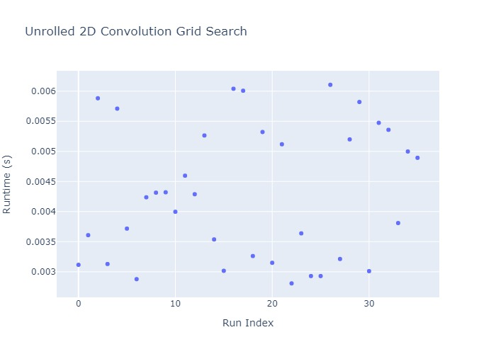

[//]: # (Project: Accera)
[//]: # (Version: 1.2.0)
# Case Study - Unrolled 2D Convolution Grid Search (part 1)

In this case study, we will discuss how to construct a performant implementation for Unrolled 2D Convolution using Accera. First, we will show how to create a parameterized Accera schedule and action plan. Then, we will discuss how to create a parameters grid, and how to benchmark each point in the grid in order to pick the best performant implementation.

A 2D convolution between a 3D input tensor of dimensions `input_rows`&times;`input_columns`&times;`input_channels` and a 4D kernel tensor of dimensions `kernel_rows`&times;`kernel_columns`&times;`input_channels`&times;`output_filters` would result in a 3D output tensor of dimensions `output_rows`&times;`output_columns`&times;`output_filters`, where `output_rows` is defined as `(input_rows - kernel_rows)/row_stride + 1`, and `output_columns` is defined as `(input_columns - kernel_columns)/column_stride + 1`. `row_stride` and `column_stride` control the stride for the convolution. The logic for the 2D covolution can be expressed in python as follows

```python
for out_f in range(output_filters):
    for out_r in range(output_rows):
        for out_c in range(output_columns):
            for in_ch in range(input_channels):
                for k_r in range(kernel_rows):
                    for k_c in range(kernel_columns):
                        in_r = out_r * row_stride + k_r
                        in_c = out_c * column_stride + k_c
                        if in_r >= 0 and in_r < input_rows and in_c >= 0 and in_c < input_columns:
                            Output[out_r, out_c, out_f] += Input[in_r, in_c, in_ch] * Kernel[k_r, k_c, in_ch, out_f]
```

For Unrolled Convolution, the goal is to convert the convolution operation to matrix multiplication. We can do that by using im2col operation to transform the input and the weights tensors into 2D matrices, then we multiply them. Finally, we use col2im to reshape the output back to the expected shape.

For example:

If we have a 3D input of shape (`input_rows`,`input_columns`,`input_channels`) and a 4D kernel of shape (`kernel_rows`,`kernel_columns`,`input_channels`,`output_filters`).

- First, we use im2col to reshape the 3D input tensor into 2D matrix of shape (`output_rows`&times;`output_columns`, `kernel_rows`&times;`kernel_columns`&times;`input_channels`).
- Then, we reshape the 4D kernel into 2D matrix of shape (`kernel_rows`&times;`kernel_columns`&times;`input_channels`, `output_filters`).
- Then, we multiply the 2D packed kernel matrix and the 2D packed input matrix, which results in a 2D output matrix of shape (`output_filters`, `output_rows`&times;`output_columns`).
- Finally, we use col2im to reshape the 2D packed output into 3D tensor of shape (`output_rows`,`output_columns`,`output_filters`).

In this case study, we are going to explain two different methods to implement unrolled convolution. In the first method, we leverage caching and tiling to achieve the same behaviour of unrolled convolution without explicitly using im2col and col2im operations. In the second method, we split the unrolled convolution into different steps, and create a separate schedule for each step and finally fuse them together (see the second method in part two of this case study).

In this case study, we present the end-to-end steps needed to write a performant implementation for Unrolled 2D Convolution as follows:

- [Write a parameterized Accera implementation for Unrolled 2D Convolution](#step-1-create-a-accera-unrolled-convolution-function)
- [Create a parameters grid for the parameterized implementation](#step-2-create-parameters-grid)
- [Filter the parameters grid according to some heuristics and intuitive rules](#step-3-filter-the-parameters-grid)
- [Create a Accera package using the filtered parameters grid](#step-4-create-a-accera-package-with-all-parameters-choices-in-the-filtered-parameters-grid)
- [Benchmark the package on the target hardware](#step-5-benchmark-the-package-on-the-target-hardware)
- [Find the optimal parameters choice](#step-6-find-the-optimal-parameters-choice)
- [Create a Accera package with the optimal function](#step-7-create-a-accera-package-with-the-optimal-function)
- [Visualize the parameters grid as well as the benchmarking results](#step-8-visualize-the-parameters-grid)

## Step 1 - Create a Accera Unrolled Convolution Function
In this part of the case study, we use caching and tiling to implement unrolled convolution. Recall that in the unrolled convolution, we multiply a 2D packed input matrix of shape (`output_rows`&times;`output_columns`, `kernel_rows`&times;`kernel_columns`&times;`input_channels`) with a 2D packed kernel matrix of shape (`kernel_rows`&times;`kernel_columns`&times;`input_channels`, `output_filters`), and the 2D packed output has a shape (`output_rows`&times;`output_columns`, `output_filters`).

The main operation in both convolution and matrix multiplication is the multiply and accumulate. Therefore, if we can find a way to make the convolution loops mimic a matrix multiplication loops and by using caching, we can mimic the performance of unrolled convolution, without actually having to use im2col and col2im which adds an overhead to the unrolled convolution.

Recall from the matrix multiplication case study, we implemented a matrix multiplication between an `M`&times;`S` matrix `A` and an `S`&times;`N` matrix `B`, will result in an `M`&times;`N` matrix `C`, where `C += A @ B`.

In our unrolled convolution case, let matrix `A` represents the input matrix of shape (`output_rows`&times;`output_columns`, `kernel_rows`&times;`kernel_columns`&times;`input_channels`), so the `M` dimension corresponds the product of the 2 dimensions `output_rows`&times;`output_columns`, and the `S` dimension corresponds to the product of the 3 dimensions `kernel_rows`&times;`kernel_columns`&times;`input_channels`.

Similarly, let matrix `B` represent the kernel matrix of shape (`kernel_rows`&times;`kernel_columns`&times;`input_channels`, `output_filters`), so the `N` dimension corresponds to the `output_filters`.

Recall from the matrix multiplication case study, we started with 3 dimensions (i.e. `M`, `N`, and `S`), and we applied a tiling split per dimension to fit some active tiles of the input and output matrices in the L2 Cache, then we will also do a second round of smaller splits, unrolling and vectorization along some dimensions to make use of the registers on the target hardware.

For convolution, we will start with the 6 dimensions (`output_filters`, `output_rows`, `output_columns`, `kernel_rows`,`kernel_columns`, `input_channels`) and use tiling to achieve the same behaviour.

First, to mimic the first split in the `M` dimension, we choose to split the `output_columns` once, and run `output_rows` sequentially with the remaining part of `output_columns` after the split. Then, to mimic the first split in the `N` dimension, we choose to split the `output_filters` once. Finally, to mimic the first split in the `S` dimension, we choose to split the `input_channels` once, and run `kernel_rows` and `kernel_columns` sequentially with the remaining part of `input_channels` after the split.

For the second round of tiles, we choose to split `output_filters` again twice for unrolling and vectorization.

Now, let's write the Accera code to represent this sequence.

First, we define the input and output arrays
```python
Input = acc.Array(role=acc.Array.Role.INPUT, element_type=acc.ScalarType.float32, \
            shape=(input_rows, input_columns, input_channels))
Kernel = acc.Array(role=acc.Array.Role.INPUT, element_type=acc.ScalarType.float32, \
            shape=(kernel_rows, kernel_columns, input_channels, output_filters))
Output = acc.Array(role=acc.Array.Role.INPUT_OUTPUT, element_type=acc.ScalarType.float32, \
            shape=(output_rows, output_columns, output_filters))
```

Then, we define some parameters that would be used later while creating the schedule and the action plan
```python
p_outf_split1_size, p_outf_split2_size, p_outf_split3_size, p_outc_split_size, p_in_ch_split_size = acc.create_parameters(5)
```

Then, we define the iteration logic for 2D convolution.
```python
nest = acc.Nest(shape=(output_filters, output_rows, output_columns, \
                        input_channels, kernel_rows, kernel_columns))

out_f, out_r, out_c, in_ch, k_r, k_c = nest.get_indices()

@nest.iteration_logic
def _():
    in_r = out_r * row_stride + k_r
    in_c = out_c * column_stride + k_c
    Output[out_r, out_c, out_f] += Input[in_r, in_c, in_ch] * Kernel[k_r, k_c, in_ch, out_f]
```

Next, we define the convolution schedule. As mentioned earlier, we choose to first do a tiling split per dimension to improve cache utilization, then we do a second round of smaller splits to improve register utilization.

Recall from the matrix multiplication case study, we concluded that the following splits and order optimize cache and registers utilization.
```python
# Tile splits to place some blocks of the input and output matrices in the L2 cache
ii, jj, kk = schedule.tile(indices=(i, j, k), shape=(p_m_split_size, p_n_split_size, p_s_split_size))

# Kernel splits
kkk = schedule.split(kk, p_s_split_2_size)
jjj = schedule.split(jj, p_n_split_2_size)
jjjj = schedule.split(jjj, p_n_split_3_size)

# Start from this order that separates the large scale loops (i, j, k)
# from the high performance loops (jj, kk, kkk, ii, jjj, jjjj)
schedule.reorder(i, j, k, jj, kk, kkk, ii, jjj, jjjj)
```

In the unrolled convolution, our ultimate goal is to convert the convolution operation into a matrix multiplication, so we choose the splits and the loop order to mimic the schedule of the performant matrix multiplication as discovered from the matrix multiplication case study.

```python
schedule = nest.create_schedule()

# Tile splits to place some blocks of the input and output matrices in the L2 cache
out_f2 = schedule.split(out_f, outf_split1_size) # jj
out_c2 = schedule.split(out_c, outc_split_size) # ii
in_ch2 = schedule.split(in_ch, in_ch_split_size) # kk

# Kernel splits
out_f3 = schedule.split(out_f2, outf_split2_size) # jjj
out_f4 = schedule.split(out_f3, outf_split3_size) # jjjj

schedule.reorder(out_f, # j
                 in_ch, k_r,  # k
                 out_r, out_c, # i
                 out_f2, # jj
                 in_ch2, # kk
                 k_c, # kkk
                 out_c2, # ii
                 out_f3, # jjj
                 out_f4 # jjjj
                )
```
Then, we define an action plan. In this caching-based unrolled convolution, we depend on caching to reshape the input, kernel, and output in the right way needed for unrolled convolution. The tile sizes along with the level at which we cache controls the tile size at which we *unroll/pack* the input, kernel, and output arrays.

As mentioned in [Section 6](../Manual/06%20Action%20plans%20-%20Caching.md) of the manual, a cache is a local copy of an active block, and the memory layout may be different from the layout of the original array. The contents of the active block are copied into the cache at the beginning of the corresponding *index*, and the shape depends on the following indices determined by the schedule order. For example, caching the `Input` tensor at index `in_ch2` would pack a block of the input of shape (`in_ch2`, `k_c`, `out_c2`) because these are the indices that index into the `Input` tensor and follow `in_ch2` in the loop order. `in_ch2` and `k_c` belong to the `S` dimension, while `out_c2` belongs to the `M` dimension, this fold to (`S`, `M`) dimension mapping, and so is a column-major submatrix of the matrix that would have resulted from unrolling the Input tensor.

Similarly, caching the `Kernel` tensor at index `out_f2` would pack a block of the kernel of shape (`out_f2`, `in_ch2`, `k_c`, `out_f3`, `out_f4`). `out_f2`, `out_f3`, and `out_f4` belong to the `N` dimension, while `in_ch2` and `k_c` belong to the `S` dimension. Therefore, the caching would result in an (`N`, `S`, `N`) packed matrix, and so is the packed format of the matrix that would have resulted from unrolling the `Kernel` tensor.

```python
plan = schedule.create_action_plan()

plan.cache(Input, index=in_ch2)
plan.cache(Kernel, index=out_f2)
plan.cache(Output, index=out_f2)
```
We also use unrolling, and vectorization to make the implementation more performant.
```python
plan.unroll(out_c2)
plan.unroll(out_f3)
plan.vectorize(out_f4)
```

To create a package with this matrix multiplication function, we need to know the values of the parameters `p_outf_split1_size`, `p_outf_split2_size`, `p_outf_split3_size`, `p_outc_split_size`, and `p_in_ch_split_size`. Let's assume for now that we are given those constants, then we could set those parameters, and add the function to the Accera package and build it. However, we will explain in the next section how to get the right values for them

```python
name = "unrolled_conv_using_caching"
outf_split1_size = 128
outf_split2_size = 16
outf_split3_size = 8
outc_split_size = 6
in_ch_split_size = 128
auxiliary_data = {"outf_split1_size": outf_split1_size,
                  "outf_split2_size": outf_split2_size,
                  "outf_split3_size": outf_split3_size,
                  "outc_split_size": outc_split_size,
                  "in_ch_split_size": in_ch_split_size
                 }

package = acc.Package()
function = package.add_function(plan,
                                args=(Input,
                                      Kernel,
                                      Output),
                                parameters={
                                    p_outf_split1_size: outf_split1_size,
                                    p_outf_split2_size: outf_split2_size,
                                    p_outf_split3_size: outf_split3_size,
                                    p_outc_split_size: outc_split_size,
                                    p_in_ch_split_size: in_ch_split_size,
                                },
                                auxiliary=auxiliary_data,
                                base_name=name)
package.build(name, format=acc.Package.Format.HAT, output_dir=name)
```

## Step 2 - Create parameters grid
As mentioned in the previous step, we assumed some values for the split sizes, however, for each different hardware the parameters values that produces the best performing implementation can be different. To ensure that the created Accera function is performant (i.e. has the right parameters), we define a parameters grid where our chosen parameters are:

1. `outf_split1_size`
2. `outf_split2_size`
3. `outf_split3_size`
4. `outc_split_size`
5. `in_ch_split_size`

and our grid will consist of a set of candidate values for those parameters.

For example, we might want to:

1. define the `outf_split1_size` and `in_ch_split_size` as any power of 2 between 32 and 256.
2. define the `outf_split2_size` and `outf_split3_size` as any power of 2 between 4 and 32.
3. define the `outc_split_size` as any even number betweem 4 and 8.

First we define the choices for each parameter,

```python
# define the outf_split1_size and in_ch_split_size as any power of 2 between 32 and 256
outf_split1_size_candidates = [32, 64, 128, 256]
in_ch_split_size_candidates = [32, 64, 128, 256]

# define the outf_split2_size and outf_split3_size as any power of 2 between 4 and 32
outf_split2_size_candidates = [4, 8, 16, 32]
outf_split3_size_candidates = [4, 8, 16, 32]

# define the outc_split_size as any even number between 4 and 8
outc_split_size_candidates= [4, 6, 8]
```

Next, we construct out parameters grid by getting all the combinations
```python
parameters_choices = [outf_split1_size_candidates,
                      outf_split2_size_candidates,
                      outf_split3_size_candidates,
                      outc_split_size_candidates,
                      in_ch_split_size_candidates]

parameters_grid = list(itertools.product(*parameters_choices))
```

## Step 3 - Filter the parameters grid
we can notice that some points in the parameters grid might not be worth searching. For example:

1. It is meaningless to choose a second split of size larger than the first split on the same dimension, so we can filter those cases out.
2. We know that we need the active tiles of the input and output matrices to fit in the L2 cache without overflowing it, so we can choose the tile sizes such that the total memory needed for the active tiles of the input and output matrices are at least 50% of the cache size, but less that its total size.

Note that the utility functions `valid_split_size`, `fits_in_l2`, and `uses_enough_l2` are implemented in `utils.py`.

```python
filtered_parameter_grid = []

for parameters_choice in parameters_grid:
    outf_split1_size, outf_split2_size, outf_split3_size, outc_split_size, in_ch_split_size = parameters_choice

    if not valid_split_size(outf_split1_size, outf_split2_size) \
        or not valid_split_size(outf_split2_size, outf_split3_size) \
        or not fits_in_l2(outc_split_size, outf_split1_size, in_ch_split_size, 4, 256) \
        or not uses_enough_l2(outc_split_size, outf_split1_size, in_ch_split_size, 4, 256):
        continue
    else:
        filtered_parameter_grid.append(parameters_choice)
```
## Step 4 - Create a Accera package with all parameters choices in the filtered parameters grid
In this step, we would create a Accera package with all the parameters variants in the filtered parameters grid.

```python
package = acc.Package()
for parameters_choice in parameters_grid:
    add_unrolled_conv2d_function(input_shape, kernel_shape, output_filters,row_stride, column_stride,
                                 package=package, parameters_choice=parameters_choice)

# Build the accera package
package.build("unrolled_conv_using_caching", format=acc.Package.Format.HAT, output_dir=output_directory)
```

## Step 5 - Benchmark the package on the target hardware
Finally, we can use the autobenchmarking tool to check the correctness of the function implementation, and benchmark our Accera package on the target hardware, then we write back the results to the package.
```python
benchmark = AutoBenchmark(package_directory)

functions = benchmark.functions
for function_name in functions:
    if "Initialize" in function_name in function_name: # Skip init functions
        continue
    correctness_check_values = get_input_output_pairs(*args)

    # NOTE: We place the benchmarking in try .. except block to prevent stopping
    #       the gridsearch in case of a function that failed the correctness check.
    #       However, this is redundunt in this case study since all the applied transformations are safe.
    try:
        mean_time_secs, _ = benchmark.run(function_name,
                                       min_timing_iterations=5,
                                       warmup_iterations=1,
                                       correctness_check_values=correctness_check_values)

        if write_back:
            # Write back the runtime to the HAT file
            hat_file_path = os.path.join(package_directory, "unrolled_conv_using_caching" + ".hat")
            write_back_to_hat(hat_file_path, function_name, mean_time_secs)
    except:
        print(f"WARNING: function {function_name} failed correctness check.")
```

## Step 6 - Find the optimal parameters choice
In this step, we will simple load the data from the HAT file to a pandas dataframe, and then the optimal parameters choice would be the one with minimum runtime.
```python
data = get_auxiliary_data(output_directory)
dataframe = load_to_dataframe(data)
optimal_point_idx = dataframe['runtime'].idxmin()
optimal_point = dataframe.iloc[optimal_point_idx]
return optimal_point
```

This would return the optimal parameters as shown below.
```
outf_split1_size           256
outf_split2_size            16
outf_split3_size             8
outc_split_size              6
in_ch_split_size           128
runtime               0.002807
```

We can notice that those parameters match the optimal parameters that we got from the matrix multiplication grid search case study.

## Step 7 - Create a Accera package with the optimal function
Finally, we would use the optimal parameters to create a Accera package with the best performant function.
```python
# Create a new Accera package using the optimal parameters
optimal_package = acc.Package()

optimal_parameters = [int(optimal_point["outf_split1_size"]),
                      int(optimal_point["outf_split2_size"]),
                      int(optimal_point["outf_split3_size"]),
                      int(optimal_point["outc_split_size"]),
                      int(optimal_point["in_ch_split_size"])]

add_unrolled_conv2d_function(input_shape, kernel_shape, output_filters, row_stride, column_stride,
                             package=optimal_package, parameters_choice=optimal_parameters)

# Build the accera package
optimal_output_directory = output_directory + "_optimal"
optimal_package.build("unrolled_conv_using_caching", format=acc.Package.Format.HAT, output_dir=optimal_output_directory)
```

## Step 8 - Visualize the parameters grid
Finally, we load the package into a [pandas](https://pandas.pydata.org/) dataframe, and use the visualization tool [plotly](https://plotly.com/) to visualize the parameters grid as well as the benchmarking results. Note that the utility functions get_auxiliary_data and load_to_dataframe are implemented in `utils.py`.

```python
def plot_dataframe(df, output_directory):
    '''
        plot the runtime and annotate the points with iteration parameters
    '''
    import plotly.express as px
    fig = px.scatter(df, x="idx", y="runtime", \
                        labels={"runtime": "Runtime (s)", "idx": "Run Index"}, \
                        hover_data=["outf_split1_size", "outf_split2_size", "outf_split3_size", \
                                    "outc_split_size", "in_ch_split_size"], \
                        title=f"Unrolled 2D Convolution Grid Search",
                        color_continuous_scale=px.colors.sequential.Bluered)

    fig.write_html(os.path.join(output_directory, f"package_and_benchmarking_visualization_color.html"))
    fig.write_image(os.path.join(output_directory, f"package_and_benchmarking_visualization_color.jpeg"))

data = get_auxiliary_data(output_directory)
dataframe = load_to_dataframe(data)
plot_dataframe(dataframe, output_directory)
```

The figure below shows the output parameters grid. Each point represents a different point from our parameters grid, and the y-axis represents the runtime in seconds.



## Pull it all together
For convenience, we wrote all the code snippets used in this case study [here](samples/Convolution/Partially Unrolled/unrolled_conv2d_grid_search_case_study.py) and [here](samples/Convolution/Partially Unrolled/utils.py). To run all the case study steps, download the code samples and run:
```shell
python unrolled_conv2d_grid_search_case_study.py --input_shape 7 7 512 --kernel_shape 3 3 --output_filters 512 --stride 1 1 --output_directory unrolled_conv2d_grid_search_case_study
```
